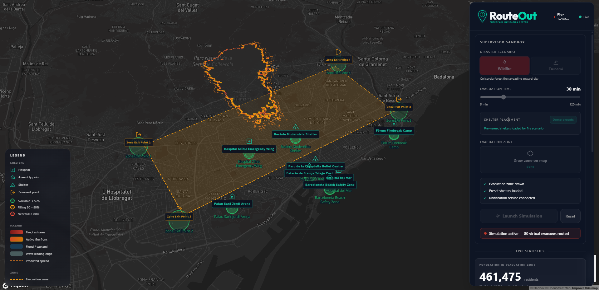
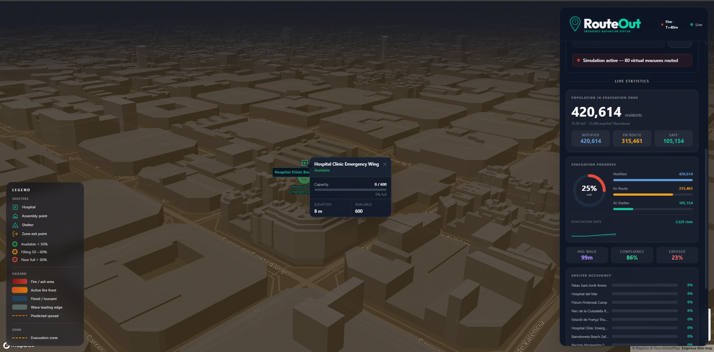
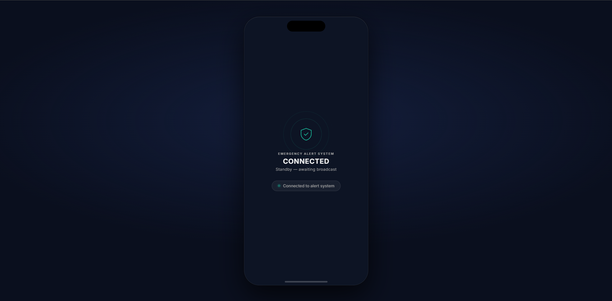
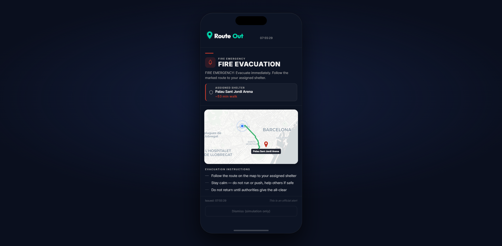
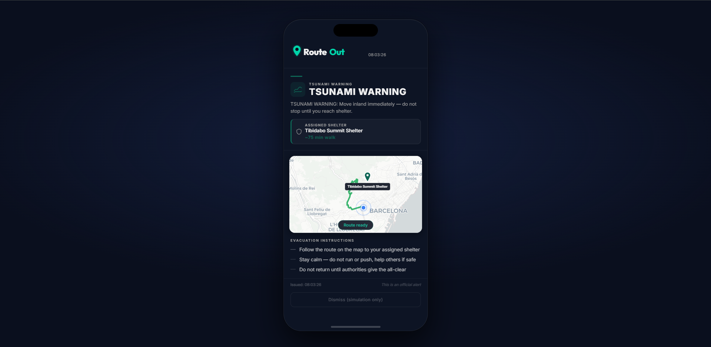

# RouteOut — Real-Time Disaster Evacuation Intelligence

> Built at **HackUPC 2026** in 36 hours.

RouteOut is a full-stack emergency evacuation system that bridges the gap between an incident command centre and every citizen on the ground. A coordinator draws an evacuation zone on a live map, launches a disaster simulation, and every connected device instantly receives a personalised shelter assignment with a street-level evacuation route — while the hazard physics evolve in real time.

---

## Screenshots

### Coordinator Dashboard



The supervisor dashboard overlays the live simulation on a full-screen Barcelona map. The right panel shows the Gemma 4 hazard analysis card, real-time evacuation statistics scaled to district population, and the map legend. Virtual evacuees appear as dots with colour-coded routes; shelter rings change colour as occupancy climbs. The fire front and predicted spread zone update every tick.

---

### Coordinator Dashboard — Detail



Close-up of the control panel mid-simulation. The Gemma 4 analysis card shows confidence score, detected spread rate, source count, and the wind vector extracted from the AEMET bulletin. Below it, the live statistics section tracks evacuees en route, citizens that reached safety, reroute events, and estimated clearance time.

---

### Citizen PWA — Standby



The citizen app sits in standby until a simulation is launched. The shield pulse animation indicates a live WebSocket connection to the backend. No personal data is collected at this stage — the app simply waits for a broadcast.

---

### Citizen PWA — Fire Evacuation Alert



The moment a wildfire simulation launches, every connected device receives a full-screen alert. The app requests the user's GPS position, queries the backend for the nearest available shelter, and renders a street-level route on a Leaflet map. Shelter name, estimated walking time, and distance are shown. If the initial GPS request is blocked (Safari), a tap-to-locate button is shown instead.

---

### Citizen PWA — Tsunami Warning



For tsunami scenarios, citizens near the Barceloneta coastline are routed to elevated inland shelters rather than lateral ones. The routing engine accounts for elevation when scoring shelter candidates, ensuring coastal residents are directed uphill rather than along the flood path.

---

## Features

- **Live physics simulation** — cellular automata wildfire and BFS coastal tsunami inundation, both running on a 420 × 420 cell elevation grid of Greater Barcelona
- **Street-level A\* routing** — every virtual evacuee follows the actual Barcelona road network (OSMnx graph, ~180 k nodes)
- **Dynamic rerouting** — routes are recomputed every tick if the hazard polygon grows to intersect a citizen's path or engulf their assigned shelter
- **Tier-aware shelter assignment** — scored by distance, remaining capacity, elevation, and danger margin; exit points are preferred over internal shelters when time is short
- **Gemma 4 hazard analysis** — reads a real AEMET weather bulletin, a social media post, and a civil protection report, then returns a structured confidence score and spread assessment shown on the coordinator dashboard
- **Live AEMET weather** — wind direction and speed are pulled from Barcelona's Observatori Fabra station at launch
- **Push-to-phone alerts** — a Node.js notification microservice forwards the alert to every citizen PWA within ~1 s of launch via WebSocket
- **Population-scale statistics** — the dashboard extrapolates the 30-agent simulation to Barcelona district population scale for a realistic operational picture

---

## Architecture

```
┌─────────────────────────────────────────────────────────────────┐
│                        CLIENT LAYER                             │
│                                                                 │
│  ┌──────────────────────┐      ┌──────────────────────────┐    │
│  │  Coordinator Dashboard│      │     Citizen PWA           │    │
│  │  React 18 + MapLibre  │      │  Vanilla JS + Leaflet     │    │
│  │  Tailwind CSS + Vite  │      │  Progressive Web App      │    │
│  └──────────┬───────────┘      └────────────┬─────────────┘    │
│             │ WebSocket                      │ WebSocket         │
└─────────────┼──────────────────────────────-┼──────────────────┘
              │                               │
              ▼                               ▼
┌─────────────────────────────────────────────────────────────────┐
│                    FASTAPI BACKEND  :8000                        │
│                                                                  │
│  POST /simulation/launch ──► SimulationEngine.launch()          │
│  POST /simulation/reset  ──► SimulationEngine.reset()           │
│  GET  /simulation/state  ──► snapshot JSON                      │
│  GET  /simulation/shelters/{type}                               │
│  GET  /simulation/best-shelter?lat=&lon=                        │
│  WS   /ws ──────────────► broadcast_state() every tick         │
│                                                                  │
│  ┌─────────────────────────────────────────────────────────┐   │
│  │                   SimulationEngine                       │   │
│  │                                                          │   │
│  │  ┌──────────────┐  ┌──────────────┐  ┌──────────────┐  │   │
│  │  │ FireSpread   │  │ TsunamiModel │  │  FloodModel  │  │   │
│  │  │ Simulator    │  │              │  │              │  │   │
│  │  │ CA 420×420   │  │ BFS coastal  │  │  (flood)     │  │   │
│  │  └──────────────┘  └──────────────┘  └──────────────┘  │   │
│  │                                                          │   │
│  │  ┌──────────────┐  ┌──────────────┐  ┌──────────────┐  │   │
│  │  │  Pathfinder  │  │  SafeZones   │  │  CrowdFlow   │  │   │
│  │  │  A* on OSMnx │  │  Tier scorer │  │  Congestion  │  │   │
│  │  └──────────────┘  └──────────────┘  └──────────────┘  │   │
│  │                                                          │   │
│  │  ┌──────────────┐  ┌──────────────┐                     │   │
│  │  │LLMSynthesiser│  │  Invalidation│                     │   │
│  │  │  Gemma 4     │  │  Tick loop   │                     │   │
│  │  └──────────────┘  └──────────────┘                     │   │
│  └─────────────────────────────────────────────────────────┘   │
└──────────────────────────────┬──────────────────────────────────┘
                               │ HTTP
              ┌────────────────┼─────────────────┐
              ▼                ▼                  ▼
   ┌──────────────┐  ┌──────────────────┐  ┌─────────────────┐
   │  AEMET API   │  │  Gemini API      │  │  Notification   │
   │  Live weather│  │  Gemma 4 model   │  │  Service :9000  │
   │  Barcelona   │  │  Hazard analysis │  │  Node.js        │
   └──────────────┘  └──────────────────┘  └────────┬────────┘
                                                     │ WebSocket
                                              ┌──────▼────────┐
                                              │  Citizen PWAs  │
                                              │  (phones)      │
                                              └───────────────┘
```

### Simulation tick loop

Each tick runs every 1 s of wall-clock time (= 8 simulated minutes):

```
tick N
  │
  ├─ 1. advance_physics()          hazard grows one step
  │      FireSpreadSimulator.tick()   CA neighbour propagation + ember spotting
  │      TsunamiModel.tick()          BFS coastal flood advance
  │
  ├─ 2. _advance_citizens()        each evacuee walks 600 m along their route
  │      linear interpolation on GeoJSON LineString coordinates
  │      citizen.status → reached_safety when end of path reached
  │
  ├─ 3. _check_routes()            reroute if any of three triggers fire:
  │      • route LineString intersects danger polygon  (Shapely)
  │      • assigned shelter is now inside danger polygon
  │      • remaining travel time > remaining scenario time × 1.15
  │
  ├─ 4. tick counter + elapsed_minutes advance
  │
  ├─ 5. recompute_statistics()
  │
  └─ 6. broadcast_state()          full JSON snapshot → all WS clients
```

### WebSocket payload schema

```
WebSocketPayload
  ├── scenario          ScenarioState   (active, type, elapsed, wind)
  ├── statistics        Statistics      (evacuating, reached, reroutes, clearance)
  ├── citizens          GeoJSON FC      (point per evacuee + status)
  ├── routes            GeoJSON FC      (LineString per evacuee)
  ├── safe_zones        GeoJSON FC      (shelters + occupancy)
  ├── fire_front        GeoJSON Polygon (active burn perimeter)
  ├── ash_geojson       GeoJSON Polygon (burned area)
  ├── danger_geojson    GeoJSON Polygon (current hazard extent)
  ├── predicted_zone    GeoJSON Polygon (15-min forecast)
  ├── notifications     NotificationCard[]
  ├── llm_synthesis     LLMSynthesisResult (Gemma confidence, spread, wind)
  └── notification_service_online   bool
```

---

## Repository Structure

```
RouteOut/
├── dashboard/
│   ├── backend/
│   │   ├── app/
│   │   │   ├── api/
│   │   │   │   ├── routes.py          REST endpoints + launch orchestration
│   │   │   │   ├── schemas.py         Pydantic models for all API contracts
│   │   │   │   └── websocket.py       WS hub + broadcast_state()
│   │   │   ├── core/
│   │   │   │   ├── fire_spread.py     Cellular automata fire simulator
│   │   │   │   ├── tsunami_model.py   BFS coastal inundation model
│   │   │   │   ├── flood_model.py     Riverine flood model
│   │   │   │   ├── pathfinder.py      A* routing on OSMnx graph
│   │   │   │   ├── safe_zones.py      Tier-based shelter scorer
│   │   │   │   ├── crowd_flow.py      Incremental congestion map
│   │   │   │   ├── llm_synthesiser.py Gemma 4 / Claude hazard analysis
│   │   │   │   └── invalidation.py    Simulation tick loop
│   │   │   ├── services/
│   │   │   │   └── aemet.py           AEMET live weather client
│   │   │   ├── data/
│   │   │   │   ├── demo_shelters.py   Pre-named shelter presets
│   │   │   │   └── scenarios.json     LLM input texts + fallback hazard events
│   │   │   └── engine.py             Singleton SimulationEngine
│   │   ├── data/
│   │   │   └── barcelona_graph.graphml  OSMnx road network (~180 k nodes)
│   │   └── requirements.txt
│   └── frontend/
│       └── src/
│           ├── pages/
│           │   ├── Coordinator.jsx    Supervisor dashboard
│           │   └── Citizen.jsx        Evacuee PWA view
│           ├── components/
│           │   ├── Map/               MapLibre GL map components
│           │   └── Dashboard/         Statistics, ControlPanel, LLMLog
│           └── hooks/
│               └── useWebSocket.js    WS connection + state sync
└── notification/
    ├── backend/
    │   ├── main.py                    Express-style push notification server
    │   └── push.py                    Web Push dispatcher
    └── frontend/
        ├── index.html                 Citizen PWA (single-file, no build step)
        ├── app.js                     Alert rendering + Leaflet routing
        └── sw.js                      Service worker for background push
```

---

## Tech Stack

| Layer | Technology |
|---|---|
| Coordinator dashboard | React 18, Vite, Tailwind CSS, MapLibre GL JS |
| Citizen PWA | Vanilla JS + Leaflet, Progressive Web App, Service Worker |
| Backend API | Python 3.11, FastAPI, Uvicorn |
| Real-time transport | Native WebSockets (FastAPI) |
| Road network | OSMnx, NetworkX — Barcelona graph, ~180 k nodes |
| Spatial operations | Shapely, NumPy |
| Fire simulation | Custom cellular automata — 420 × 420 elevation grid |
| Tsunami simulation | BFS coastal inundation — Gaussian terrain model |
| LLM hazard analysis | Gemma 4 (`gemma-3-27b-it`) via Google AI Studio / Gemini API |
| Live weather | AEMET OpenData API — Observatori Fabra station, Barcelona |
| Push notifications | Node.js / Python `web-push`, Cloudflare Tunnel |

---

## Getting Started

### Prerequisites

- Python 3.11+
- Node.js 18+
- A Gemini API key (free at [aistudio.google.com](https://aistudio.google.com)) for Gemma 4

### 1. Backend

```bash
cd dashboard/backend
pip install -r requirements.txt

# Configure environment
cp .env.example .env
# Edit .env — set GEMINI_API_KEY, optionally AEMET_API_KEY and MAPBOX_TOKEN

uvicorn app.main:app --reload --port 8000
```

### 2. Coordinator dashboard

```bash
cd dashboard/frontend
npm install
npm run dev        # http://localhost:5173
```

### 3. Notification service

```bash
cd notification/backend
pip install -r requirements.txt
python main.py     # http://localhost:9000
```

### 4. Citizen PWA

Open `notification/frontend/index.html` directly in a browser, or serve via the notification backend. For phone access, expose port 9000 through Cloudflare Tunnel:

```bash
cloudflared tunnel --url http://localhost:9000
# Scan the printed QR code on a phone
```

### Environment variables

| Variable | Required | Description |
|---|---|---|
| `GEMINI_API_KEY` | Yes | Gemma 4 inference via Google AI Studio |
| `AEMET_API_KEY` | No | Live Barcelona weather (falls back to typical values) |
| `MAPBOX_TOKEN` | No | MapLibre satellite tiles (falls back to CartoDB) |
| `LLM_PROVIDER` | No | `gemma` (default) · `gemini` · `anthropic` |
| `TICK_INTERVAL_SECONDS` | No | Wall-clock seconds per simulation tick (default `1`) |

---

## How the Physics Work

### Wildfire — cellular automata

The grid covers Greater Barcelona at ~30 m/cell resolution. Each cell stores:
- **elevation** — multi-Gaussian terrain model (Tibidabo 512 m, Collserola ridge, Montjuïc 184 m)
- **vegetation factor** — 0.12 (dense urban) → 0.85 (Collserola forest)

Each tick, every burning cell attempts to ignite each of its 8 neighbours. Ignition probability is:

```
P = base_prob × wind_factor × slope_factor × vegetation_factor
```

where `wind_factor` peaks when the neighbour is directly downwind, and `slope_factor` gives uphill spread a 2× advantage. After `max_burn_age` ticks a cell transitions to ash and stops propagating. Ember spotting independently seeds new ignition points 3–8 cells downwind at low probability.

### Tsunami — BFS inundation

Ten coastal seed points run from Port Vell to Forum. Each tick, a scheduled wave run-up height (peak 12 m at ticks 3–4) sets the flood threshold. BFS expands from coastline seeds into all cells below the threshold, blocked by the Montjuïc hill Gaussian. The leading edge is separated into a predicted-zone layer to convey forward risk to citizens.

### Routing — A\* on the road graph

The Barcelona OSMnx graph is loaded once at first launch and cached on the engine. For each citizen, A\* finds the shortest path to their assigned shelter, with edge weights penalised for proximity to the danger polygon. A shared congestion counter is incremented per road segment as citizens are spawned, so later assignments automatically avoid already-crowded streets. Dynamic rerouting re-runs the full A\* from the citizen's current GPS position every tick when any of three triggers fire.

---

## Accomplishments

- **Sub-second launch** — virtual evacuees appear on the map within 2–3 s of clicking Launch; DEM initialisation, graph loading, Gemma inference, and alert forwarding are all off the critical path
- **Physics that behave like physics** — fire follows the wind, accelerates uphill, jumps roads via ember spotting; tsunami inundation respects Barcelona's real coastal topography
- **End-to-end push to phone** — a coordinator action reaches every citizen's phone as a full-screen alert with a personalised route within ~1 s
- **No fake data** — all statistics are derived from real agent state; population-scale figures are mathematically extrapolated from simulation progress

---

## Challenges

**Latency at every layer.** The first version took 20–40 s to launch. Profiling revealed three independent bottlenecks: a 170,000-iteration Python loop building the elevation model, a blocking timeout waiting for the notification microservice, and a synchronous LLM call on the launch critical path. Each was fixed independently by vectorising with NumPy, making service forwarding non-blocking, and running Gemma as a background task.

**The tsunami model produced a thin diagonal stripe.** The initial implementation AND-ed the BFS flood result against the inland evacuation zone polygon, removing all coastal cells. Fixing it required removing all zone clipping from the flood model — tsunami inundation ignores administrative boundaries.

**The Google Generative AI SDK was deprecated mid-hackathon.** We started with `google-generativeai`, discovered it had been replaced by `google-genai` with a completely different API surface, and rewrote the integration.

---

## Team

Built at HackUPC 2026 in Barcelona.
